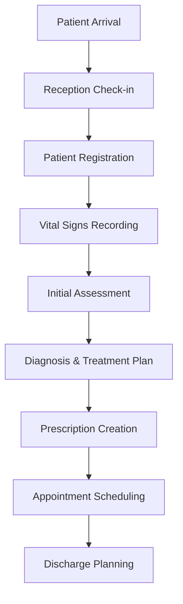
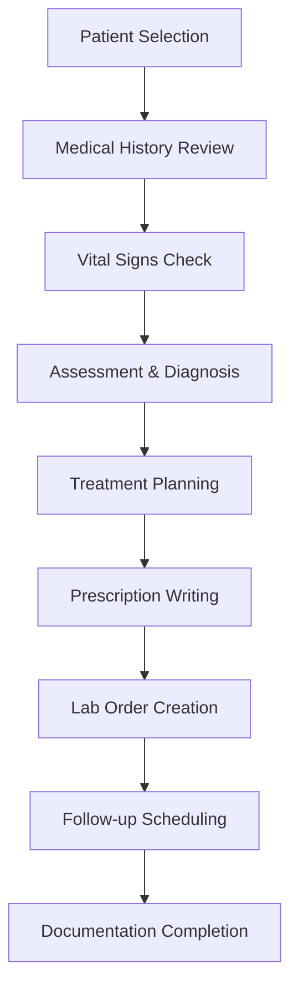
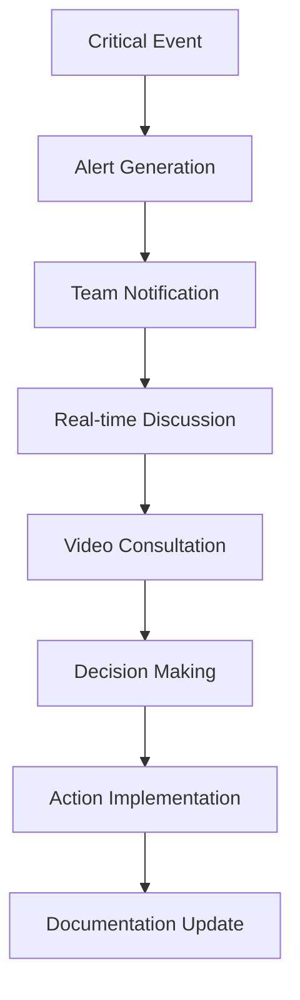

# Curenium EHR - Seamless Healthcare Management System

<div align="center">
  

  **A comprehensive Electronic Health Records (EHR) system designed for modern healthcare facilities**

  [](https://nextjs.org/)
  [](https://reactjs.org/)
  [](https://www.typescriptlang.org/)
  [](https://www.mongodb.com/)
  [](https://socket.io/)
  [](LICENSE)

  [Live Demo](https://curenium.com) • [Documentation](https://docs.curenium.com) • [API Reference](https://api.curenium.com)
</div>

---

## 📋 Table of Contents

- [🎯 Overview](#-overview)
- [✨ Key Features](#-key-features)
- [🏗️ Architecture](#️-architecture)
- [🔄 User Flows](#-user-flows)
- [🛠️ Technology Stack](#️-technology-stack)
- [🚀 Quick Start](#-quick-start)
- [📊 Data Models](#-data-models)
- [🔐 Security](#-security)
- [📱 Mobile Support](#-mobile-support)
- [🎨 UI/UX Design](#-uiux-design)
- [🔌 API Documentation](#-api-documentation)
- [📈 Performance](#-performance)
- [🚀 Deployment](#-deployment)
- [🤝 Contributing](#-contributing)
- [📄 License](#-license)

---

## 🎯 Overview

**Curenium EHR** is a state-of-the-art Electronic Health Records system that revolutionizes healthcare management through seamless digital workflows, real-time collaboration, and comprehensive patient care coordination. Built for modern healthcare facilities, it combines advanced technology with intuitive design to enhance clinical efficiency and patient outcomes.

### 🎯 Mission
To empower healthcare providers with intelligent, connected tools that streamline patient care while maintaining the highest standards of security, compliance, and user experience.

### 🎯 Vision
A healthcare ecosystem where technology seamlessly integrates with clinical workflows, enabling providers to focus on what matters most - patient care.

---

## ✨ Key Features

### 👥 **Multi-Role User Management**
- **Administrators**: Complete system oversight and user management
- **Physicians**: Comprehensive patient care and medical workflows
- **Nurses**: Vital signs monitoring and care coordination
- **Pharmacists**: Medication management and dispensing
- **Lab Technicians**: Test processing and result management
- **Reception Staff**: Patient intake and appointment scheduling

### 🏥 **Clinical Workflows**
- **Patient Management**: Complete digital patient records with medical history
- **Appointment Scheduling**: Intelligent booking system with conflict resolution
- **Diagnosis & Treatment**: ICD-10 coding with treatment planning
- **Prescription Management**: Electronic prescribing with drug interaction checking
- **Vital Signs Monitoring**: Real-time patient monitoring with trend analysis
- **Lab Order Management**: Seamless lab test ordering and result tracking

### 💬 **Communication & Collaboration**
- **Real-time Chat**: Secure messaging between healthcare team members
- **Video Calling**: Integrated telemedicine capabilities
- **Channel-based Communication**: Department-specific and cross-functional channels
- **File Sharing**: Secure document and image sharing
- **Emergency Alerts**: Critical notification system with escalation protocols

### 📊 **Analytics & Reporting**
- **Clinical Dashboards**: Real-time insights into patient care metrics
- **Audit Trails**: Comprehensive logging of all system activities
- **Performance Analytics**: Department and individual performance tracking
- **Quality Metrics**: Clinical outcome measurements and reporting

### 🌍 **Internationalization**
- **Multi-language Support**: English and Arabic interfaces
- **Cultural Adaptation**: Localized date formats and calendar systems
- **RTL Support**: Right-to-left layout for Arabic users
- **Regional Compliance**: Support for international healthcare standards

---

## 🏗️ Architecture

### **Frontend Architecture**
```
┌─────────────────────────────────────────────────────────────┐
│                    Next.js 16 Application                    │
├─────────────────────────────────────────────────────────────┤
│  • App Router (Next.js 13+ app directory structure)         │
│  • React 19 with Concurrent Features                        │
│  • TypeScript for type safety                               │
│  • Tailwind CSS for styling                                 │
│  • Framer Motion for animations                             │
├─────────────────────────────────────────────────────────────┤
│  Components:                                                │
│  • Reusable UI components (Radix UI)                        │
│  • Feature-specific components                              │
│  • Layout components with role-based rendering             │
│  • Real-time components with Socket.IO integration         │
└─────────────────────────────────────────────────────────────┘
```

### **Backend Architecture**
```
┌─────────────────────────────────────────────────────────────┐
│                 Custom Node.js Server                       │
├─────────────────────────────────────────────────────────────┤
│  • Next.js API Routes (App Router)                         │
│  • Socket.IO for real-time communication                   │
│  • NextAuth.js for authentication                          │
│  • MongoDB with Mongoose ODM                               │
│  • AWS S3 for file storage                                 │
│  • Redis for session management                            │
├─────────────────────────────────────────────────────────────┤
│  Services:                                                 │
│  • Authentication & Authorization                          │
│  • Real-time messaging                                     │
│  • File upload & processing                                │
│  • Email notifications                                     │
│  • Audit logging                                           │
└─────────────────────────────────────────────────────────────┘
```

### **Database Schema**
```
Users (Role-based access control)
├── Patients (Comprehensive medical records)
├── Appointments (Scheduling & management)
├── Prescriptions (Medication management)
├── Lab Orders (Test ordering & results)
├── Clinical Notes (SOAP notes, progress notes)
├── Vital Signs (Monitoring data)
├── Audit Logs (Compliance tracking)
├── Organizations (Multi-tenant support)
└── Channels (Communication management)
```

---

## 🔄 User Flows

### **Patient Admission Flow**


### **Clinical Workflow**


### **Real-time Collaboration Flow**


---

## 🛠️ Technology Stack

### **Core Framework**
- **Next.js 16**: React framework with App Router
- **React 19**: Latest React with concurrent features
- **TypeScript**: Type-safe development

### **Styling & UI**
- **Tailwind CSS**: Utility-first CSS framework
- **Radix UI**: Accessible component primitives
- **Framer Motion**: Animation library
- **Lucide React**: Icon library

### **Backend & Database**
- **Node.js**: Server runtime
- **MongoDB**: NoSQL database
- **Mongoose**: ODM for MongoDB
- **NextAuth.js**: Authentication framework

### **Real-time Features**
- **Socket.IO**: Real-time bidirectional communication
- **LiveKit**: Video calling infrastructure
- **Pusher**: Real-time notifications

### **File Management**
- **AWS S3**: Cloud storage
- **Cloudinary**: Media management
- **PDF Processing**: Document generation

### **Development Tools**
- **ESLint**: Code linting
- **TypeScript**: Type checking
- **Tailwind CSS**: Styling
- **Wrangler**: Cloudflare Workers

---

## 🚀 Quick Start

### **Prerequisites**
- Node.js 18+
- MongoDB 6+
- Redis (optional, for sessions)
- AWS S3 bucket (for file storage)

### **Installation**

1. **Clone the repository**
   ```bash
   git clone https://github.com/curenium/curenium-ehr.git
   cd curenium-ehr
   ```

2. **Install dependencies**
   ```bash
   npm install
   ```

3. **Environment Setup**
   ```bash
   cp .env.example .env.local
   ```

   Configure the following variables:
   ```env
   # Database
   MONGODB_URI=mongodb://localhost:27017/curenium

   # Authentication
   NEXTAUTH_SECRET=your-secret-key
   NEXTAUTH_URL=http://localhost:3000

   # AWS S3
   AWS_ACCESS_KEY_ID=your-access-key
   AWS_SECRET_ACCESS_KEY=your-secret-key
   AWS_S3_BUCKET=your-bucket-name

   # Email (Resend)
   RESEND_API_KEY=your-resend-api-key

   # LiveKit (Video calling)
   LIVEKIT_API_KEY=your-livekit-key
   LIVEKIT_API_SECRET=your-livekit-secret
   ```

4. **Database Setup**
   ```bash
   # Start MongoDB
   mongod

   # Run database migrations (if any)
   npm run db:migrate
   ```

5. **Development Server**
   ```bash
   npm run dev
   ```

6. **Access the Application**
   Open [http://localhost:3000](http://localhost:3000)

### **Production Deployment**

```bash
# Build the application
npm run build

# Start production server
npm start
```

---

## 📊 Data Models

### **Core Entities**

#### **User Model**
```typescript
interface User {
  _id: ObjectId;
  email: string;
  name: string;
  role: 'admin' | 'doctor' | 'nurse' | 'pharmacist' | 'labtech' | 'reception';
  organizationId: ObjectId;
  profile: {
    avatar?: string;
    bio?: string;
    phone?: string;
  };
  permissions: string[];
  isActive: boolean;
  createdAt: Date;
  updatedAt: Date;
}
```

#### **Patient Model**
```typescript
interface Patient {
  _id: ObjectId;
  mrn: string; // Medical Record Number
  personalInfo: {
    firstName: string;
    lastName: string;
    dateOfBirth: Date;
    gender: 'male' | 'female' | 'other';
    phone: string;
    email: string;
    address: Address;
  };
  medicalInfo: {
    bloodType?: string;
    allergies: Allergy[];
    emergencyContact: EmergencyContact;
    insurance?: Insurance;
  };
  admission: {
    status: 'active' | 'discharged' | 'transferred';
    admissionDate: Date;
    department: string;
    ward: string;
    room: string;
    bed: string;
  };
  organizationId: ObjectId;
  createdAt: Date;
  updatedAt: Date;
}
```

#### **Appointment Model**
```typescript
interface Appointment {
  _id: ObjectId;
  patientId: ObjectId;
  doctorId: ObjectId;
  nurseId?: ObjectId;
  date: Date;
  duration: number; // minutes
  type: 'consultation' | 'followup' | 'procedure' | 'emergency';
  status: 'scheduled' | 'confirmed' | 'completed' | 'cancelled' | 'no-show';
  purpose: string;
  notes?: string;
  organizationId: ObjectId;
  createdAt: Date;
  updatedAt: Date;
}
```

---

## 🔐 Security

### **Authentication & Authorization**
- **NextAuth.js**: Industry-standard authentication
- **JWT Tokens**: Secure token-based authentication
- **Role-Based Access Control (RBAC)**: Granular permissions
- **Session Management**: Secure session handling

### **Data Protection**
- **Encryption**: Data encryption at rest and in transit
- **HIPAA Compliance**: Healthcare data protection standards
- **Audit Logging**: Comprehensive activity tracking
- **Access Controls**: Field-level and record-level security

### **Network Security**
- **CORS Configuration**: Controlled cross-origin requests
- **Rate Limiting**: Protection against abuse
- **Input Validation**: Comprehensive data validation
- **SQL Injection Prevention**: Parameterized queries

---

## 📱 Mobile Support

### **Progressive Web App (PWA)**
- **Offline Capability**: Core functionality works offline
- **Push Notifications**: Real-time alerts and updates
- **Responsive Design**: Optimized for all screen sizes
- **Touch Gestures**: Intuitive mobile interactions

### **Mobile API**
- **RESTful Endpoints**: Mobile-optimized API routes
- **JWT Authentication**: Token-based mobile authentication
- **Data Synchronization**: Offline-to-online data sync
- **Battery Optimization**: Efficient background processing

---

## 🎨 UI/UX Design

### **Design System**
- **Consistent Typography**: Cairo font family with fallbacks
- **Color Palette**: Medical-grade color schemes
- **Component Library**: Reusable, accessible components
- **Dark/Light Themes**: User preference support

### **User Experience**
- **Intuitive Navigation**: Role-based dashboard layouts
- **Progressive Disclosure**: Information revealed contextually
- **Real-time Feedback**: Immediate response to user actions
- **Accessibility**: WCAG 2.1 AA compliance

### **Responsive Design**
- **Mobile-First**: Optimized for mobile devices
- **Tablet Support**: Dedicated tablet layouts
- **Desktop Enhancement**: Full desktop feature utilization
- **Cross-Device Sync**: Seamless experience across devices

---

## 🔌 API Documentation

### **REST API Endpoints**

#### **Authentication**
```
POST   /api/auth/login
POST   /api/auth/register
POST   /api/auth/logout
GET    /api/auth/session
```

#### **Patient Management**
```
GET    /api/patients              # List patients
POST   /api/patients              # Create patient
GET    /api/patients/:id          # Get patient details
PUT    /api/patients/:id          # Update patient
DELETE /api/patients/:id          # Delete patient
```

#### **Clinical Operations**
```
GET    /api/patients/:id/vitals           # Get vital signs
POST   /api/patients/:id/vitals           # Record vitals
GET    /api/patients/:id/prescriptions    # Get prescriptions
POST   /api/patients/:id/prescriptions    # Create prescription
GET    /api/patients/:id/appointments     # Get appointments
POST   /api/patients/:id/appointments     # Schedule appointment
```

#### **Real-time Features**
```
WebSocket: /socket.io
Events:
- join_org: Join organization room
- new_lab_order: Broadcast lab order
- message: Send/receive messages
- typing: Typing indicators
```

### **API Response Format**
```json
{
  "success": true,
  "data": { ... },
  "message": "Operation successful",
  "timestamp": "2024-01-01T00:00:00.000Z"
}
```

---

## 📈 Performance

### **Optimization Features**
- **Server-Side Rendering (SSR)**: Fast initial page loads
- **Static Generation**: Pre-rendered pages for better performance
- **Image Optimization**: Automatic image compression and WebP conversion
- **Code Splitting**: Lazy loading of components and routes
- **Caching Strategy**: Multi-layer caching (CDN, Redis, Browser)

### **Real-time Performance**
- **WebSocket Optimization**: Efficient real-time communication
- **Connection Pooling**: Database connection optimization
- **Background Processing**: Asynchronous task handling
- **Memory Management**: Efficient memory usage patterns

### **Monitoring & Analytics**
- **Performance Metrics**: Real-time performance monitoring
- **Error Tracking**: Comprehensive error logging and alerting
- **User Analytics**: Usage patterns and behavior analysis
- **System Health**: Infrastructure monitoring and alerting

---

## 🚀 Deployment

### **Infrastructure Requirements**
- **Web Server**: Node.js compatible hosting (Vercel, Railway, AWS)
- **Database**: MongoDB Atlas or self-hosted MongoDB
- **File Storage**: AWS S3 or compatible service
- **Real-time**: Socket.IO compatible hosting
- **Email**: Resend, SendGrid, or SMTP service

### **Environment Configuration**
```env
# Production Environment Variables
NODE_ENV=production
MONGODB_URI=mongodb+srv://...
NEXTAUTH_URL=https://yourdomain.com
AWS_S3_BUCKET=your-production-bucket
RESEND_API_KEY=your-production-key
```

### **Deployment Commands**
```bash
# Build for production
npm run build

# Deploy to Vercel
vercel --prod

# Deploy to Railway
railway deploy

# Docker deployment
docker build -t curenium-ehr .
docker run -p 3000:3000 curenium-ehr
```

---

## 🤝 Contributing

We welcome contributions from the community! Please see our [Contributing Guide](CONTRIBUTING.md) for details.

### **Development Workflow**
1. Fork the repository
2. Create a feature branch (`git checkout -b feature/amazing-feature`)
3. Commit your changes (`git commit -m 'Add amazing feature'`)
4. Push to the branch (`git push origin feature/amazing-feature`)
5. Open a Pull Request

### **Code Standards**
- **TypeScript**: Strict type checking enabled
- **ESLint**: Code linting and formatting
- **Prettier**: Consistent code formatting
- **Husky**: Pre-commit hooks for quality assurance

---

## 📄 License

This project is licensed under the MIT License - see the [LICENSE](LICENSE) file for details.

---

## 📞 Support

- **Documentation**: [docs.curenium.com](https://docs.curenium.com)
- **Community Forum**: [community.curenium.com](https://community.curenium.com)
- **Email Support**: support@curenium.com
- **Issue Tracker**: [GitHub Issues](https://github.com/curenium/curenium-ehr/issues)

---

<div align="center">
  <p><strong>Built with ❤️ for healthcare professionals worldwide</strong></p>
  <p>
    <a href="https://curenium.com">Website</a> •
    <a href="https://docs.curenium.com">Documentation</a> •
    <a href="https://github.com/curenium/curenium-ehr">GitHub</a>
  </p>
</div></content>
<line_count>500</line_count>
</write_to_file> 
